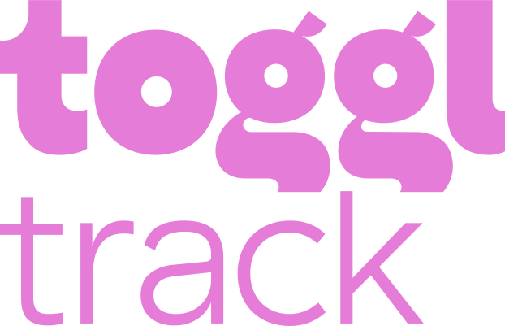

# Toggl Track browser extension integrations

[![Badge Mozilla]][Mozilla]
[![Badge Chrome]][Chrome]

## 📣 Toggl Button is now the Toggl Track browser extension!
We not only renamed the extension, but we also made several changes to Track Extension's codebase to build a better foundation for the future and make it easier to contribute new integrations.

For more information, please check this [blogpost](https://toggl.com/blog/purposeful-open-source).

---

This is the repo for the browser extension's integrations.

Start and stop the timer from the web tools you use daily. Get the time-tracking
out of the way and focus on real work.

## Table of Contents
- [How to use](#how-to-use)
  - [Installing the extension](#installing-the-extension)
  - [Using the extension](#using-the-extension)
- [Add custom domains](#add-custom-domains)
- [Supported services](#supported-services)
- [Create new integrations](#create-new-integrations)
- [Changelog](#changelog)
- [Contributing](#contributing)
- [License](#license)

## How to use

### Installing the extension

<a href="https://addons.mozilla.org/en-US/firefox/addon/toggl-button-time-tracker/">

### Using the extension

1. Log in to your [Toggl Track](https://track.toggl.com/) account from the extension popup.
2. Enable services that you want to use the browser extension with under Settings > Integrations.
3. Navigate to your [service](#supported-services) and start your Toggl timer there.

Or start entry from the extension icon menu.

3. To edit the running time entry:
  - Edit entry details from the post start popup that is shown right after you click the "Start timer" button.
  - Edit entry details from the extension icon menu by clicking the running time entry name.

4. To stop the current running timer:
  - Press the button again.
  - Stop the entry from the extension icon menu.
  - Start another time entry inside your account.

## Supported services

For a list of supported services please refer to [integrations](docs/INTEGRATIONS.md)

## Add custom domains

If one of the supported services that you use is hosted on a custom domain (e.g. https://yourcompany.github.com) you can define the custom domains in Settings > Integrations.

## Create new integrations

Do you want to create a new custom integration, and maybe share it with the rest of the world? Check the [contributing section](#contributing) for more information.

## Changelog

A list of all the changes and added features can be found at http://toggl.github.io/track-extension.

## Contributing

Want to contribute? Great! Read up our guide for [contributing](docs/CONTRIBUTING.md).
It explains in detail how to create, edit, debug and publish a new integration to the Toggl Track browser extension.

## License
The Toggl Track browser extension extension is [Apache License 2.0](LICENSE)

[Mozilla]: https://addons.mozilla.org/en-US/firefox/addon/toggl-button-time-tracker/
[Badge Mozilla]: https://img.shields.io/amo/rating/toggl-button-time-tracker?label=Firefox

[Chrome]: https://chrome.google.com/webstore/detail/toggl-button/oejgccbfbmkkpaidnkphaiaecficdnfn
[Badge Chrome]: https://img.shields.io/chrome-web-store/rating/oejgccbfbmkkpaidnkphaiaecficdnfn?label=Chrome
