# How to contribute

You can contribute to Toggl Track browser extension with new integrations or fixes for the current ones.
This guide aims to make the process for contributing clear and hopefully answers some questions that you may have.

## Table of Contents

- [Enabling development mode](#enabling-development-mode)
- [Editing built-in integration](#enabling-development-mode)
- [Adding new integration](#adding-new-integration)
- [Debugging integrations](#debugging-integrations)
- [Edit, duplicate or delete integrations](#edit-duplicate-or-delete-integrations)
- [Publishing integration](#publishing-integration)

## Enabling development mode

The tools that allows you to edit and create integrations are defined under the `Development mode` settings.

Go to Settings > Integrations

Toggle checkbox to enable or disable development mode.

## Editing built-in integration

Editing the built-in integrations allows you to fix some potential problems in an existing integration, or configure it even furter to suit your use-case and necessities.

With development mode enabled, pick up the built-in integration you want to edit. There should be a little `edit` button in the `Custom Integrations` list's entries

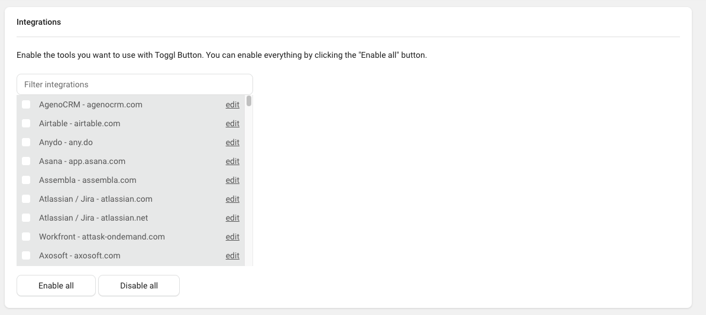

Click it and the `Edit Integration` dialog should show up. Make some changes and click `Save integration`.

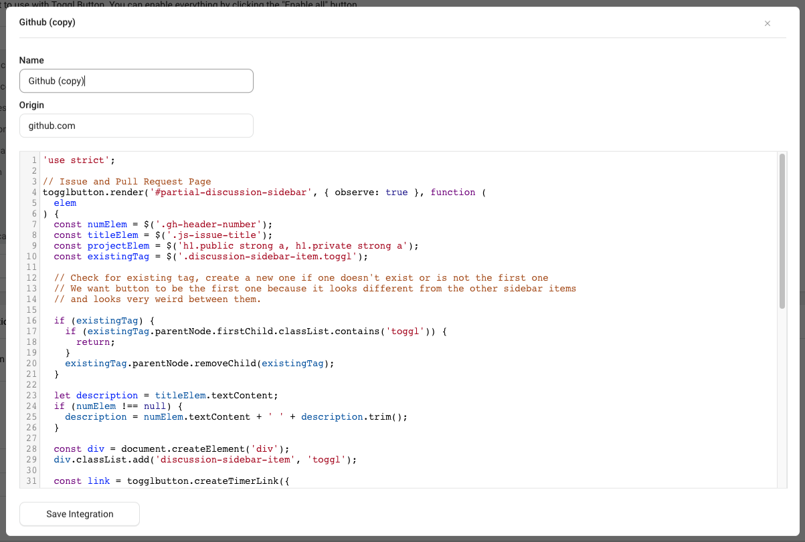

(Make sure to grant permissions if necessary).

From now on, edited integration should always be executed instead built-in one.
Let's verify it by navigating to Github.com, since it is the example we used.

Timer button should stay in the same place, and since we only changed description to be static this is exactly what we wanted.

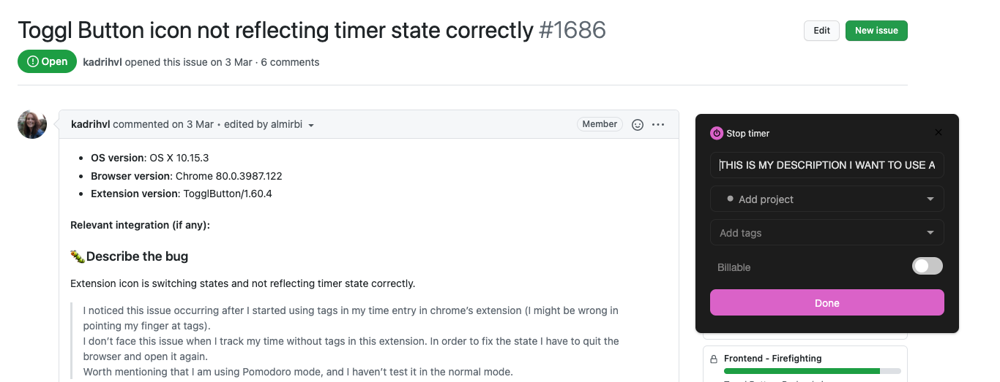

## Adding new integration
This section walks you through the process of adding a new custom integration as an example.

When clicking on `Add integration` button you'll see a modal with following fields:

- `Name` - name of your integration
- `Origin` - optional origin (ie. `github.com`)
- Code editor with empty wireframe (code) for an integration.

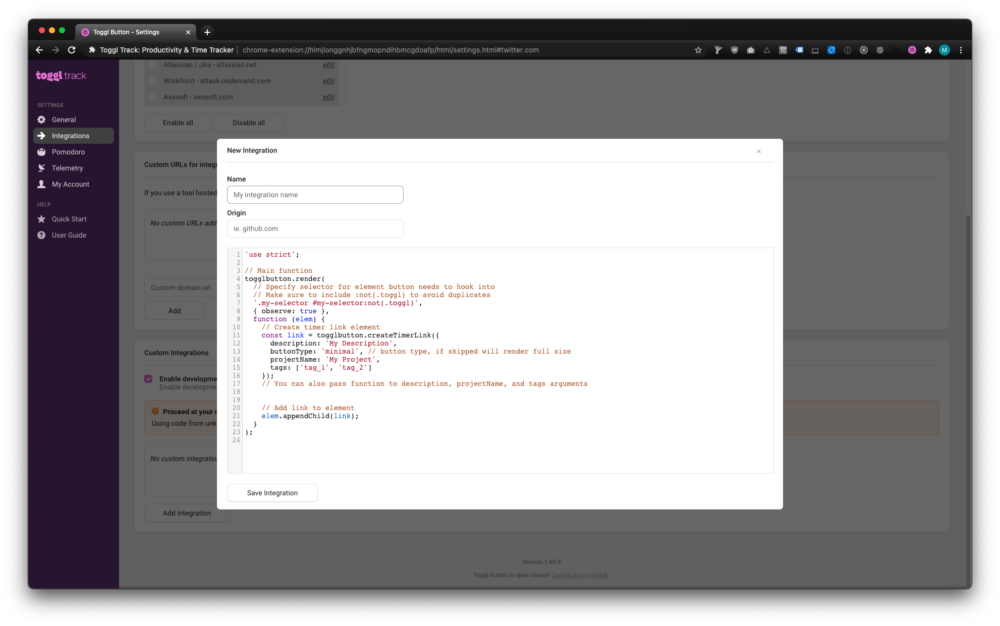

To add new integration write some code, add name and origin, and finally hit `Save integration`.
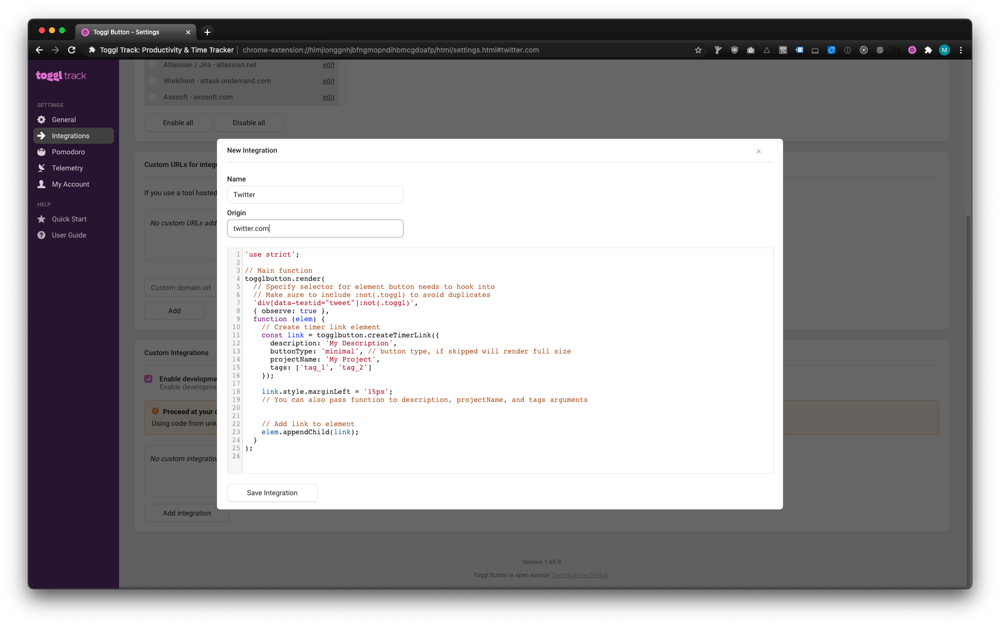

Make sure to grant access to the additional permission.

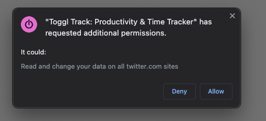

Your integrations will now show up on the `Custom Integrations` list.

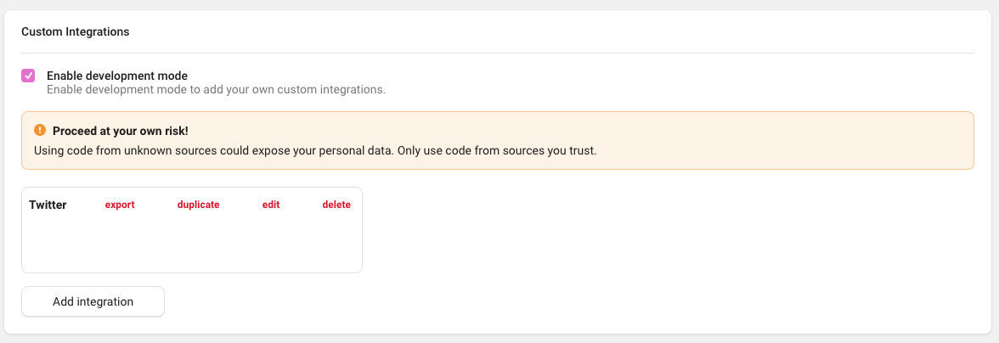

If you also specified an origin, the integration will be automatically added to the `Custom URLs` section.

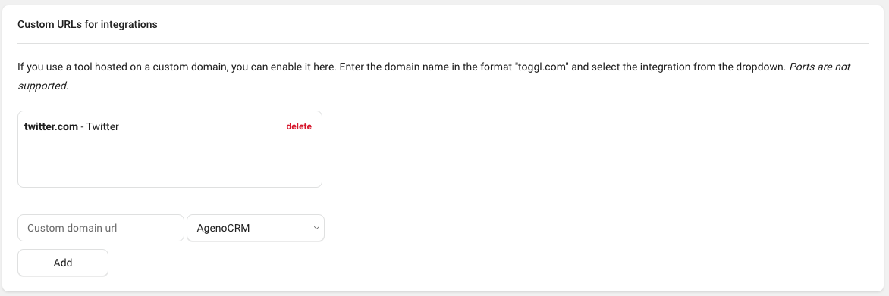

If you didn't specify an origin you can do it now by choosing your integration under the `Custom URLs` section. Make sure to hit `Add` and grant permission as in previous step.

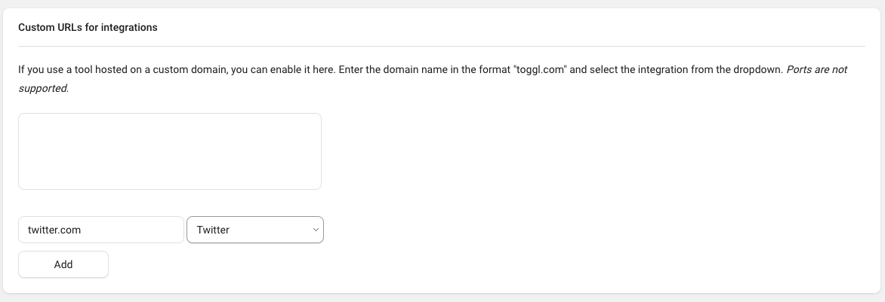

Now, the injected code should be executed on the given domain. In our case `twitter.com`. You can see Track Button rendered here:

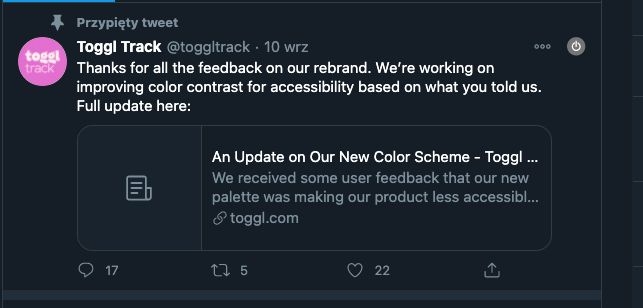

## Debugging integrations
Debugging new or current integrations should be possible by using Dev Tools.

Use the `debugger` statement to set breakpoints in the places you want.
With Dev Tools open on target site you should be able to debug your integration easily.

## Edit, duplicate or delete integrations

Use the buttons in the `Custom Integrations` list to edit, duplicate or delete your integration.

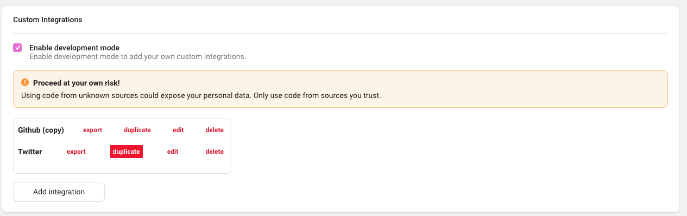

**Note:** if you delete an integration which has an origin set (visible in `Custom URLs` section) it will also be deleted from the browser extensions' permissions.

## Publishing integration

If you want to publish your integration, use the `export` button.

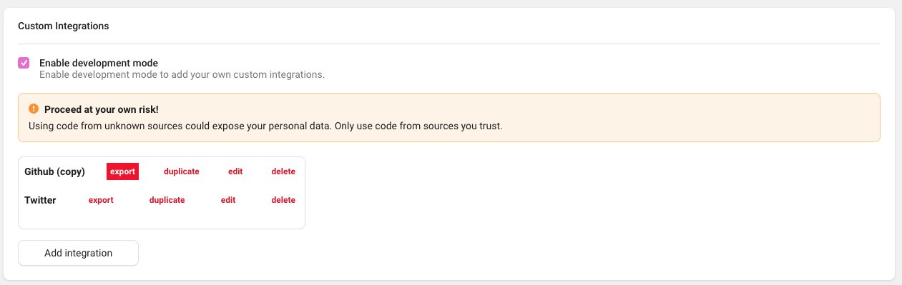

A JS file name `your-integration.js` should be saved to your device.

If you wish to submit your custom integration to the Button's core integrations, follow this steps:

- Fork [Toggl Track browser extension repo](https://github.com/toggl/track-extension/)
- Create a new branch and commit the following changes:
 - Your integration file under `to be determined`
 - New integration's origin under the `origin.js` file
- Now you just need to create a new pull request for the upstream repo and wait for a review
- If everything is ok (maybe some change will be necessary), your PR will be merged and your integration will be added in the next release 🎉
