# Creating Custom Integrations

This guide walks you through creating a custom integration for the Toggl Track browser extension — no build tools required. You'll download the extension, edit a script file, load it in Chrome, and test it.

## Table of Contents

- [Prerequisites](#prerequisites)
- [Step 1: Download the Extension](#step-1-download-the-extension)
- [Step 2: Extract the Extension](#step-2-extract-the-extension)
- [Step 3: Write Your Integration Script](#step-3-write-your-integration-script)
  - [Script Structure](#script-structure)
  - [The togglbutton API](#the-togglbutton-api)
  - [createTimerLink Options](#createtimerlink-options)
- [Step 4: Load the Extension in Chrome](#step-4-load-the-extension-in-chrome)
- [Step 5: Activate Your Script on a Domain](#step-5-activate-your-script-on-a-domain)
- [Step 6: Test Your Integration](#step-6-test-your-integration)
- [Debugging](#debugging)

## Prerequisites

- Chrome browser
- A [Toggl Track](https://track.toggl.com/) account
- A text/code editor
- Basic knowledge of JavaScript and CSS selectors

## Step 1: Download the Extension

Since the extension source is not publicly available, you need to download the published extension as a ZIP file using a CRX extractor tool such as [CRX Extractor/Downloader](https://chromewebstore.google.com/detail/crx-extractordownloader/ajkhmmldknmfjnmeedkbkkojgobmljda).

1. Install the CRX Extractor/Downloader extension
2. Navigate to the [Toggl Track extension](https://chrome.google.com/webstore/detail/toggl-button/oejgccbfbmkkpaidnkphaiaecficdnfn) on the Chrome Web Store
3. Use the CRX extractor to download the extension as a ZIP file

<p align="center">
  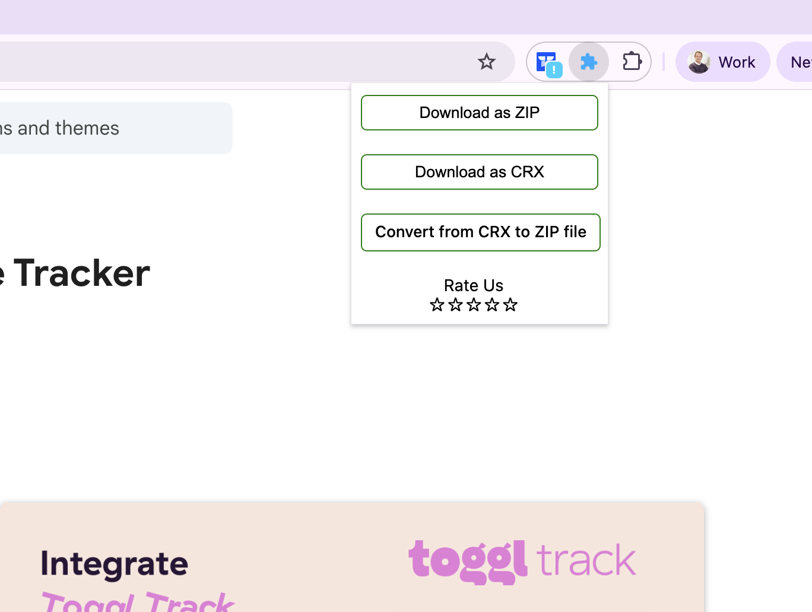
</p>

## Step 2: Extract the Extension

Extract the downloaded zip file to a folder on your computer. You should see a structure like this:

```
toggl-track-extension/
├── manifest.json
├── sw.js
├── settings.html
├── src/
│   └── content/
│       ├── _custom_SampleScript.js    <-- This is the file you'll edit
│       ├── _custom_nf_gitlab.js
│       ├── _custom_nf_jira.js
│       ├── github.js
│       ├── trello.js
│       ├── asana.js
│       ├── index.js
│       ├── style.css
│       └── ... (150+ other integration scripts)
├── images/
├── assets/
└── ...
```

The file you'll be working with is **`src/content/_custom_SampleScript.js`**.

<p align="center">
  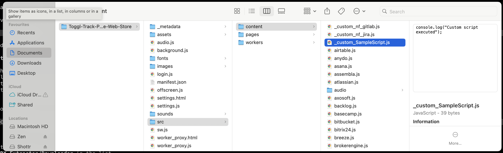
</p>

## Step 3: Write Your Integration Script

Open `src/content/_custom_SampleScript.js` in your code editor. By default it looks like this:

```js
/**
 * @name SampleScript
 * @urlAlias script_a_shortcode
 * @urlRegex app.sample.com
 */
'use strict'

console.log('Custom script executed')
```

Replace the contents with your integration code. For reference, take a look at the existing integration scripts in `src/content/` (e.g. `github.js`, `trello.js`, `asana.js`) to see real-world examples. You can also browse all available integrations in the [track-extension repository](https://github.com/toggl/track-extension/tree/master/src/content) to find one similar to the service you're integrating with.

### Script Structure

Every integration follows this pattern:

```js
/**
 * @name MyService
 * @urlAlias script_a_shortcode
 * @urlRegex myservice.com
 */
'use strict'

togglbutton.render(
  '.task-title:not(.toggl)',    // CSS selector for the element to attach to
  { observe: true },             // Re-run when DOM changes (for single-page apps)
  function (element) {
    // Extract data from the page
    const description = element.textContent.trim()

    // Create the Toggl timer button
    const link = togglbutton.createTimerLink({
      className: 'my-service',
      description: description,
    })

    // Insert the button into the page
    element.appendChild(link)
  }
)
```

**Important:** Keep `@urlAlias` set to `script_a_shortcode` — this is the shortcode used to activate the script in the extension settings (see [Step 5](#step-5-activate-your-script-on-a-domain)).

### The togglbutton API

The extension injects a global `togglbutton` object into every matched page:

| Method | Description |
|--------|-------------|
| `togglbutton.render(selector, options, renderer)` | Find an element and render a button. Re-runs automatically when the DOM changes if `{ observe: true }` is set. Best for single-page apps. |
| `togglbutton.inject({ node, renderer }, options)` | Inject a button into a single element. Gives more control over placement. |
| `togglbutton.injectMany({ node, renderer }, options)` | Inject buttons into all matching elements (e.g. list items). |
| `togglbutton.createTimerLink(config)` | Create the start/stop timer button element. |

Global helpers are also available:

| Helper | Description |
|--------|-------------|
| `$$(selector)` | Shorthand for `document.querySelectorAll(selector)` |
| `createTag(tagName, className, textContent)` | Create a DOM element with a class and optional text content |

### createTimerLink Options

| Option | Type | Required | Description |
|--------|------|----------|-------------|
| `className` | `string` | Yes | Unique CSS class for your integration |
| `description` | `string` or `() => string` | Yes | Time entry description. Use a function if the value can change dynamically. |
| `projectName` | `string` or `(projects, tasks) => string` | No | Project name to match in Toggl. When using a function, it receives the user's projects and tasks as arguments. |
| `taskId` | `number` or `(projects, tasks) => number` | No | Task ID to assign |
| `buttonType` | `string` | No | Set to `'minimal'` for a small icon-only button |
| `tags` | `string[]` or `() => string[]` | No | Tags for the time entry |
| `container` | `string` | No | CSS selector for the container element |
| `autoTrackable` | `boolean` | No | Enable auto-tracking for this button |

## Step 4: Load the Extension in Chrome

Before loading the custom extension, **disable the official Toggl Track extension** if you have it installed (to avoid conflicts).

1. Open `chrome://extensions/` in Chrome
2. Enable **Developer mode** using the toggle in the top right corner

<p align="center">
  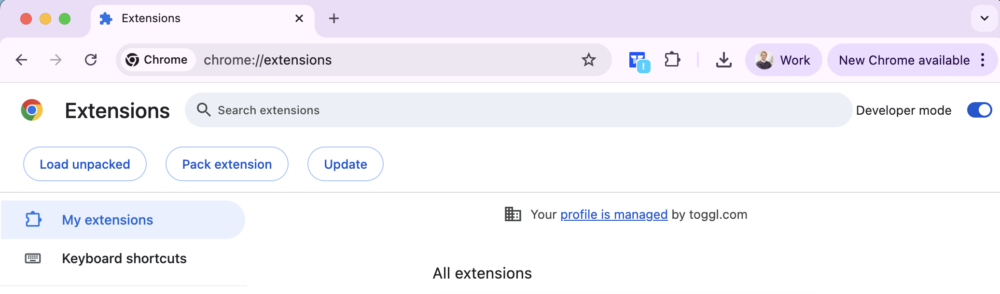
</p>

3. Click **Load unpacked**

<p align="center">
  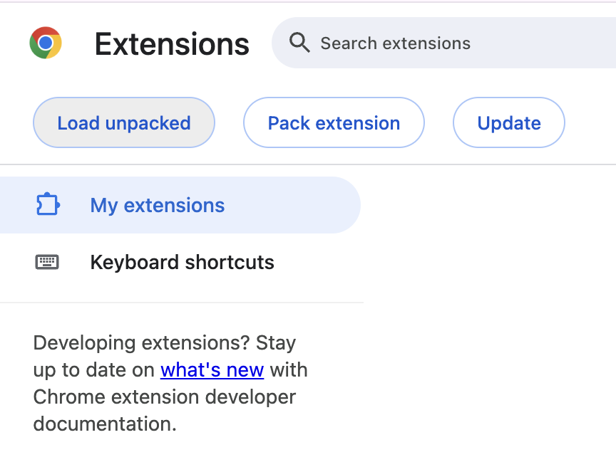
</p>

4. Select the **extracted extension folder** (the one containing `manifest.json`)

<p align="center">
  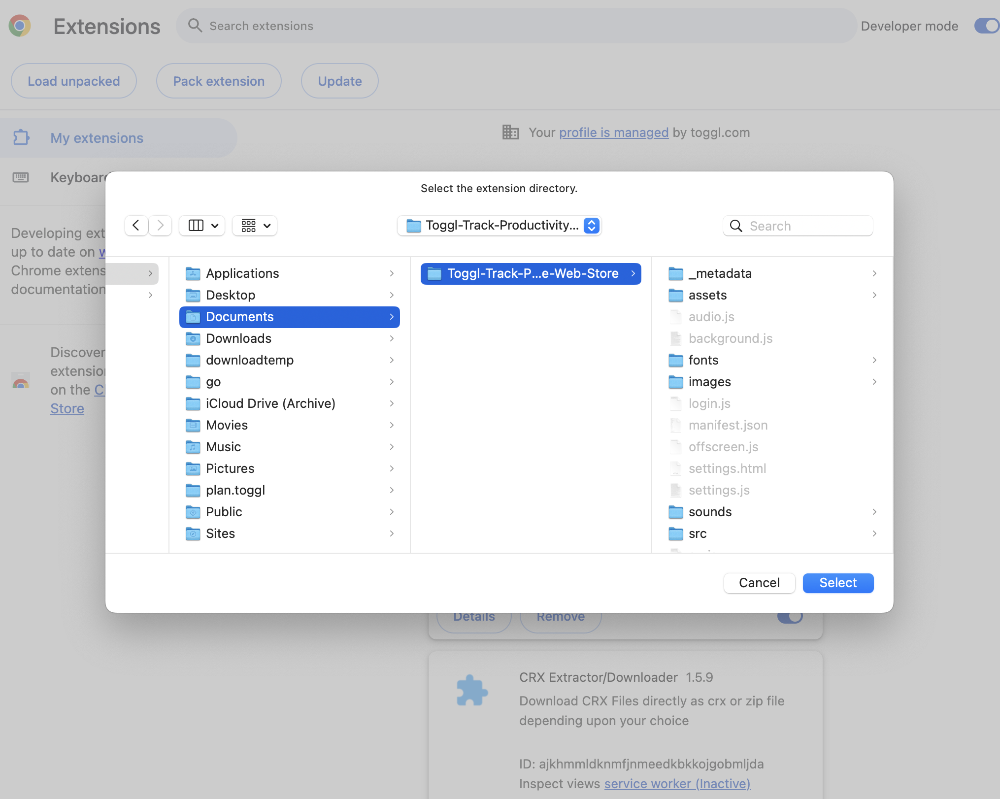
</p>

5. The extension should now appear in your extensions list

<p align="center">
  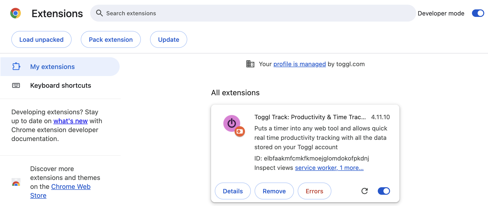
</p>

## Step 5: Activate Your Script on a Domain

After loading the extension, you need to tell it which website to run your script on.

1. Click the Toggl Track extension icon in your browser toolbar and log in to your Toggl account

<p align="center">
  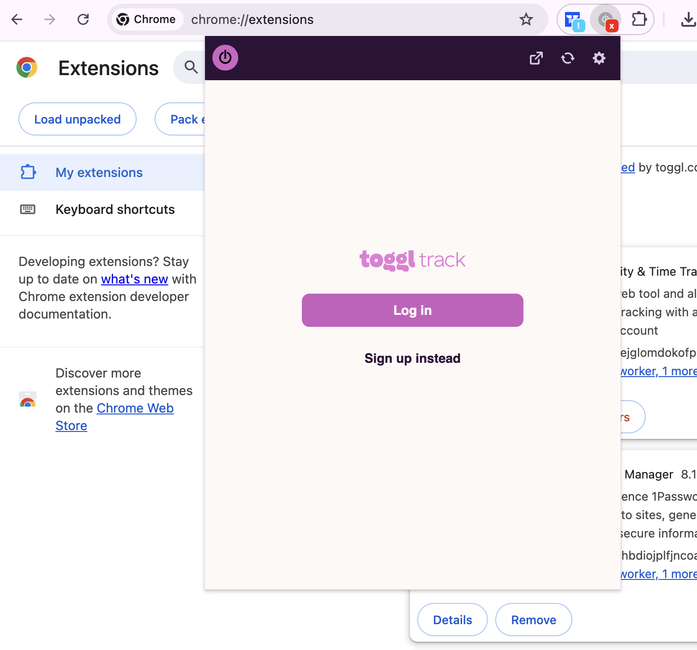
</p>

2. Open the extension **Settings** (gear icon in the popup)

3. Scroll down to the **Custom Scripts for Integrations** section

4. Enter your target domain in the **Domain** field (e.g. `myservice.com`)

5. Enter `script_a_shortcode` in the **Script Code** field — this is the shortcode that maps to the `_custom_SampleScript.js` file you edited

<p align="center">
  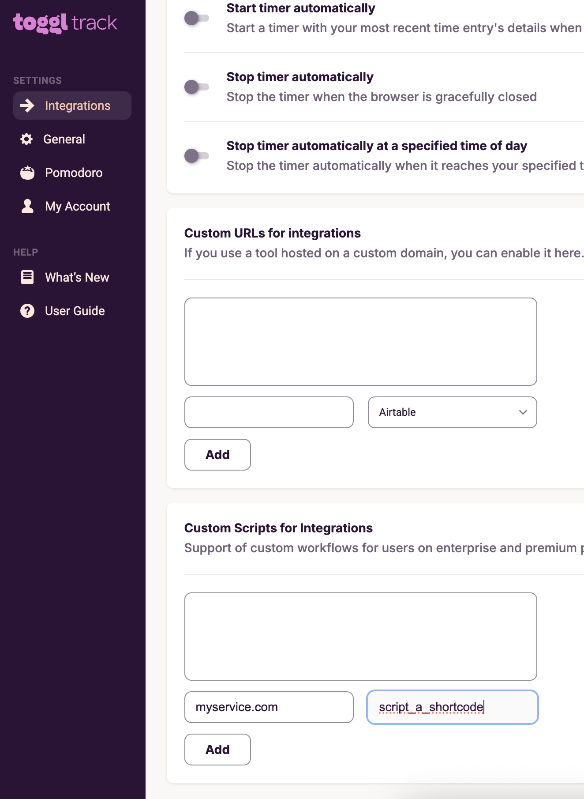
</p>

6. Click **Add** — your script will appear in the list above

<p align="center">
  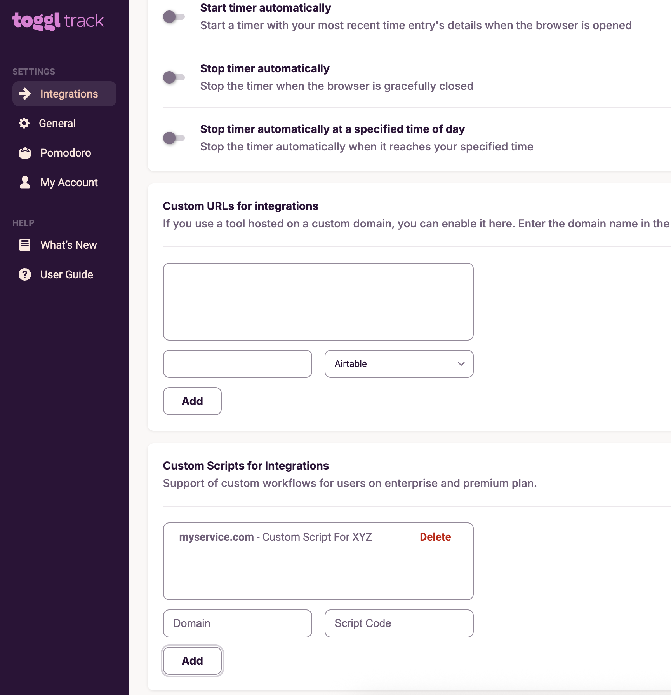
</p>

7. Grant the requested permission when prompted

Your custom script is now active on the specified domain.

## Step 6: Test Your Integration

1. Navigate to your target website
2. Find the element where your button should appear
3. You should see the Toggl Track timer button

<p align="center">
  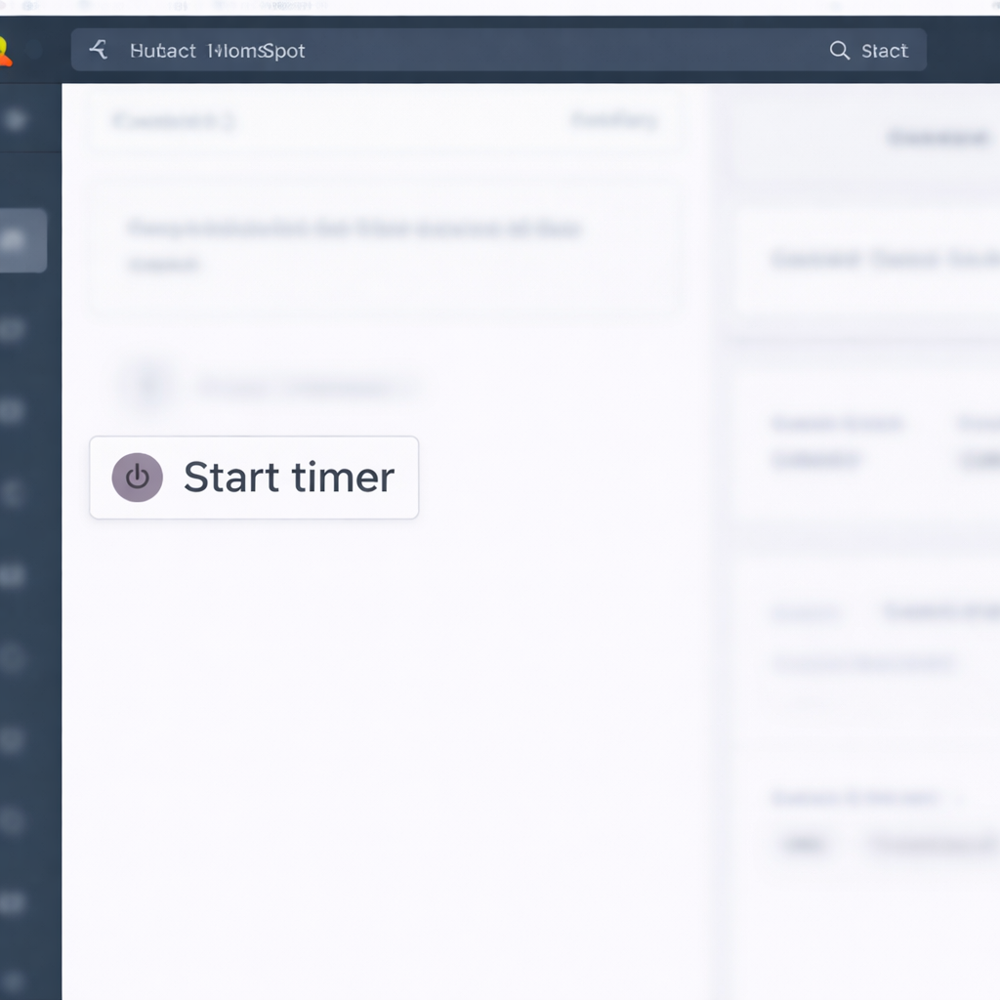
</p>

4. Click the button to start a timer — you can verify it's running in the extension popup with the correct description

<p align="center">
  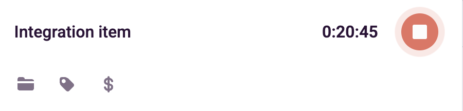
</p>

## Debugging

### Using DevTools

1. Navigate to your target website
2. Open DevTools (`F12` or `Cmd+Option+I` on Mac)
3. Check the **Console** tab for errors

### Using Breakpoints

Add `debugger` statements in your script to pause execution when DevTools is open:

```js
togglbutton.render(
  '.task-title:not(.toggl)',
  { observe: true },
  function (element) {
    debugger  // Execution pauses here when DevTools is open
    // ...
  }
)
```

<p align="center">
  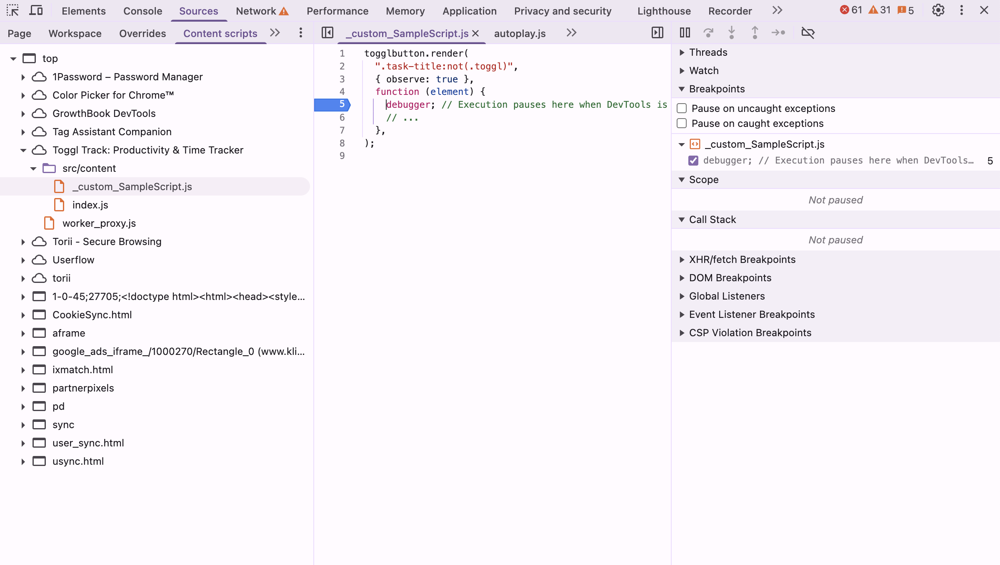
</p>

### Testing CSS Selectors

Before writing your integration, test your selectors in the DevTools Console:

```js
// Check if your selector finds the right element
document.querySelector('.task-title')

// Check all matching elements
document.querySelectorAll('.task-list-item')
```

### Common Issues

| Issue | Solution |
|-------|----------|
| Button doesn't appear | Verify your CSS selector matches an element on the page. Test it in the DevTools Console. |
| Button appears multiple times | Make sure `:not(.toggl)` is appended to your selector to prevent duplicate injection. |
| Wrong description/project | Log your selector values to the console to verify they return the expected text. |
| Button disappears on navigation | The site is likely a single-page app. Ensure `{ observe: true }` is set so the integration re-runs when the DOM changes. |
| Script not executing at all | Check that the domain in Custom Scripts settings matches the site's hostname exactly. Check the Console for errors. |

### Reloading After Changes

After editing `_custom_SampleScript.js`:

1. Go to `chrome://extensions/`
2. Click the **reload** icon on the extension card

<p align="center">
  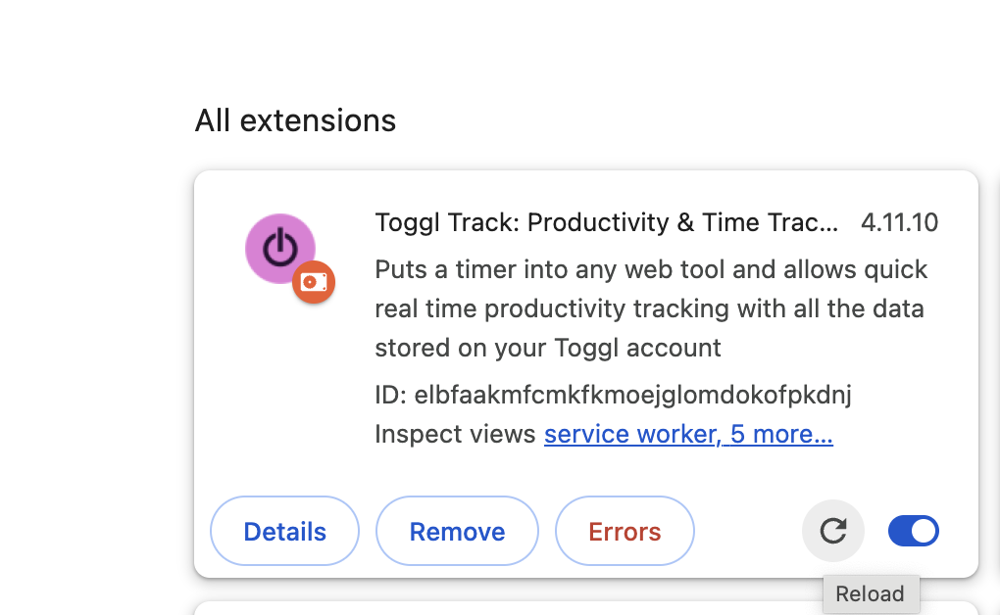
</p>

3. Refresh the target website
